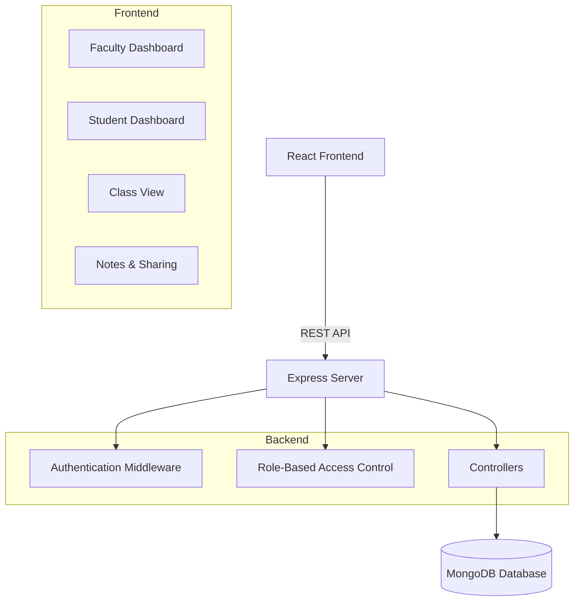
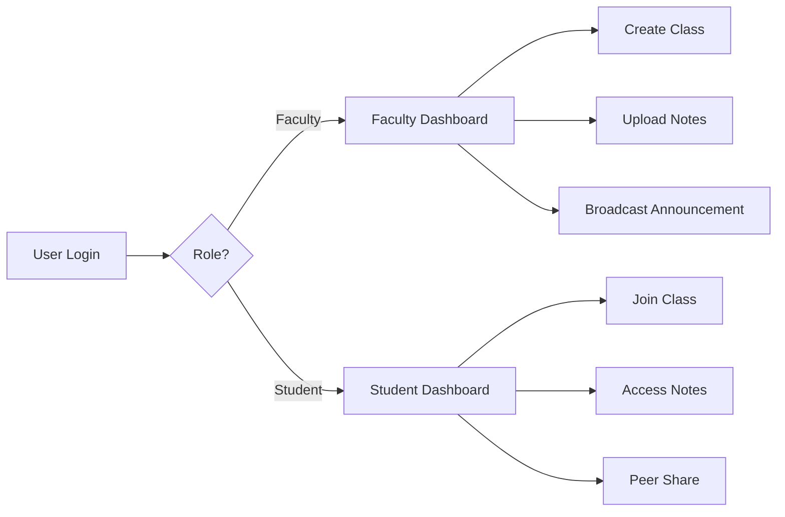

# LINK : https://edu-vault-phi.vercel.app/


<div align="center">

# EduVault – Structured Academic Intelligence Platform


**Role-Based Governance • Secure Knowledge Exchange • Performance-First Architecture**

[](#)
[](#)
[](#)
[](#)
[](#)

A full-stack academic governance platform built to replace fragmented campus note-sharing systems with structured, secure collaboration.

</div>

---

## Problem Statement

Academic collaboration in campuses is fragmented and inefficient.

- Notes are scattered across messaging apps.
- Cloud folders lack role-based structure.
- Faculty struggle to manage class resources securely.
- Students face search friction and resource inconsistency.
- No unified academic governance model exists.

EduVault solves this by modeling real academic relationships — Faculty, Classes, Students, and Resources — within a structured digital ecosystem.

---

## Solution Overview

EduVault introduces a role-driven architecture that enforces structured academic flow:

- Faculty manage classes and resources.
- Students access materials within defined visibility tiers.
- Notes are governed by secure role-based access control.
- Collaboration happens inside controlled boundaries.

The system is built for clarity, governance, and performance — not generic file storage.

---

## System Architecture



---

## Role-Based Flow



---

## Core Features

### Faculty Governance

- Create and manage academic classes
- Enroll and revoke students securely
- Upload notes with multi-level visibility
- Broadcast structured announcements
- Access student performance dashboards

### Student Ecosystem

- Join classes via secure enrollment
- Access organized academic resources
- Peer-to-peer note sharing
- Study timer with ranking integration

### Secure Note Architecture

- Visibility Tiers:
  - Personal
  - Student-only
  - Public
- Editable / Read-only collaboration modes
- “Delete for Me” local exclusion logic
- JWT-based authentication with RBAC enforcement

---

## Technology Stack

<div align="center">

### Frontend


### Backend


### Security


</div>

---

## Installation

### Clone Repository

```bash
git clone https://github.com/your-username/eduvault.git
```

---

### Backend Setup

Create a `.env` file inside `/backend`:

```
MONGO_URI=your_mongodb_connection_string
JWT_SECRET=your_secure_key
PORT=3000
```

Run:

```bash
cd backend
npm install
npm run dev
```

---

### Frontend Setup

```bash
cd frontend
npm install
npm run dev
```

---

## Design Principles

EduVault is built on:

1. Structured Academic Flow  
2. Role-Based Governance  
3. Secure Access Control  
4. Performance-First Interface  

The UI emphasizes hierarchy, clarity, and purposeful motion over decorative complexity.

---

## Future Roadmap

- AI-powered note summarization
- Real-time collaborative editing
- Advanced analytics dashboards
- Institution-level deployment support

---

<div align="center">

EduVault — structured academic collaboration engineered for clarity and governance.


</div>
<div align="center">
Developed by RAGHAVAN S
</div>
